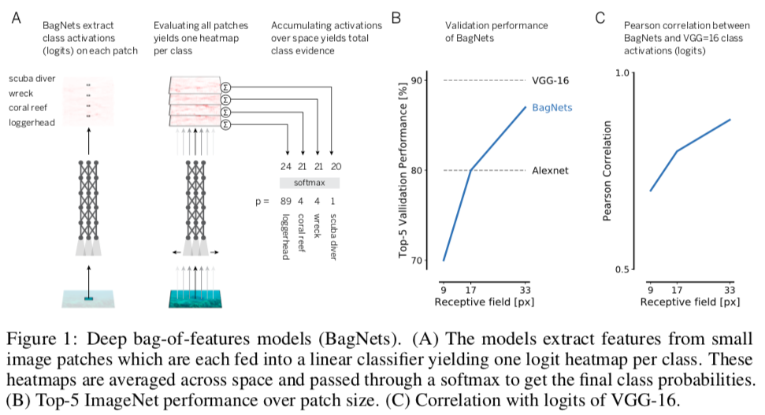
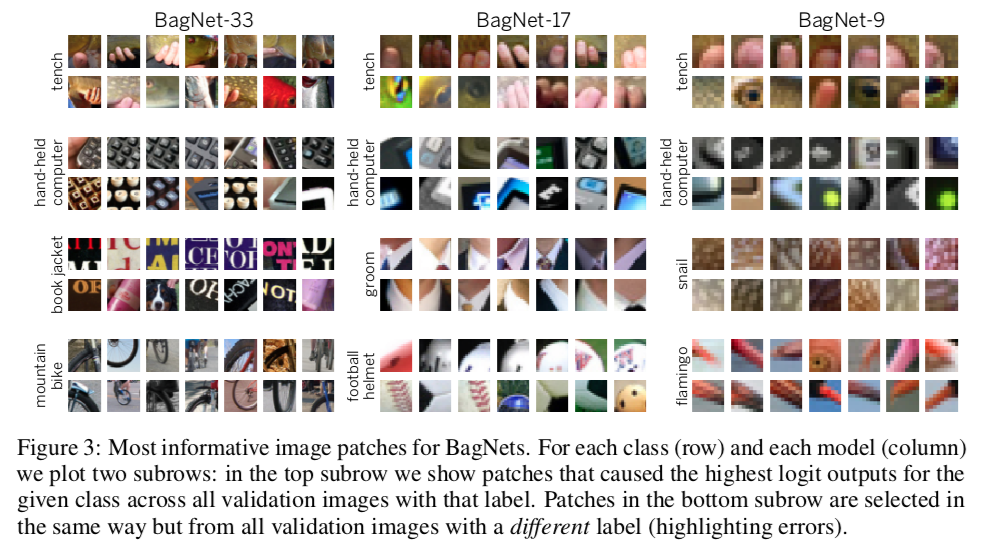
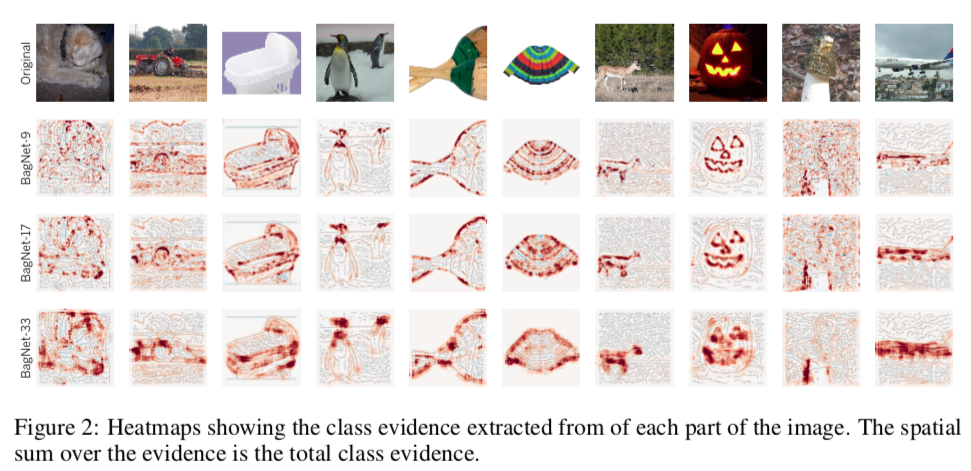

这是发表在 ICLR 2019 上的一篇关于深度神经网络可解释性的文章。

文章链接在[https://openreview.net/forum?id=SkfMWhAqYQ](https://openreview.net/forum?id=SkfMWhAqYQ)，作者的开源代码在 [https://github.com/wielandbrendel/bag-of-local-features-models](https://github.com/wielandbrendel/bag-of-local-features-models)。

<!-- more -->

-----

## Motivations

深度神经网络一直被认为是黑匣子，这篇文章就是探讨其可解释性的。何为可解释性，就是如何根据图片的patches提取到的局部特征，得到整张图片的类别决策。

这篇文章的灵感来源是BoF(bag-of-feature) models，这是在深度学习出现之前目标识别领域最成功的方法。

作者设计了BagNet的网络结构，是ResNet-50的变体，通过统计图片局部特征出现的次数来进行图片分类，而不考虑这些特征的空间关系。BagNet在 feature sensitivity、error distribution 和 interaction between image parts等方面和VGG、ResNet、DenseNet等DNN表现相似。

## Network Architecture

BagNets的网络结构如上图所示。网络结构和ResNet的唯一区别就是，将一些原来的3x3卷积层替换成了1x1卷积层（具体是哪些可以参见代码），这样可以限制最上面卷积层的感受野为qxq的大小，这样的BagNet记为BagNet-q，$q\in[9, 17, 33]$。

BagNet-17能达到AlexNet的精度，BagNet-33能达到约87%的top-5 accuracy。这表明，只需使用一组小图的特性即可解决ImageNet的分类问题，

## Discussions

BagNet的一个特色是其透明的决策，即可解释性，可以知道DNN是如何做出分类决策的。

还可以根据各个patch对决策的贡献，画出热力图。

当然，DNN并不完全类似于Bag-of-Feature model，确实有偏差，而且，网络越深，对全局的依赖性也就越大。

## Conclusion

作者通过这篇文章想说明，CNN可能遵循及其简单的分类策略（然而并不完全是这样），并且这个点可能是未来神经网络可解释性的一个发展方向。

